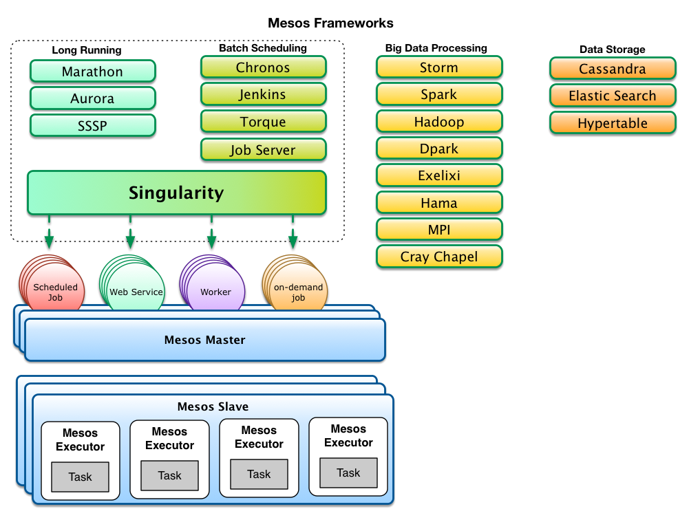

## What is Singularity
**Singularity** is a platform that enables deploying and running services and scheduled jobs in cloud infrastructures, providing efficient management of the underlying processes life cycle and effective use of the cluster resources.

Singularity can be an essential part of a continuous deployment infrastructure and is ideal for deploying micro-services. It is optimized to manage thousands of concurrently running processes in hundreds of servers and provides out of the box: 
- a rich REST API for deploying as well as getting information on active and historical deploys and their underlying processes 
- a [web app client](Docs/SingularityUI.md) (Singularity UI) that uses the API to display user friendly views to all available information
- automatic rollback of failing deploys
- automatic fail over of services when the service itself or the server fails 
- automatic cool-down of repeatedly failing services
- health checking at the process and the service endpoint level
- load balancing of multi-instance services
- log rotation and archiving
- resource limits & resource isolation per service instance and graceful killing of instances that exceed their limits
- Rack / availability zone awareness for highly available deploys 

Singularity is a core component of HubSpot PaaS infrastructure allowing us to run thousands of concurrent services and has already executed many millions of tasks in our production and QA clusters.

## How it works
Singularity is an **Apache Mesos framework**. It runs as a *task scheduler* on top of **Mesos Clusters** taking advantage of Apache Mesos scalability, fault-tolerance, and resource isolation. [Apache Mesos](http://mesos.apache.org/documentation/latest/mesos-architecture/) is a cluster manager that simplifies the complexity of running different types of applications on a shared pool of servers. In Mesos terminology, *Mesos applications* that are using Mesos APIs to schedule tasks in a cluster are called *frameworks*.

As the drawing depicts there are different types of frameworks and most frameworks concentrate in supporting a specific type of processing task (e.g. long-running vs scheduled cron-type jobs) or supporting a specific domain and relevant technology (e.g. data processing with hadoop jobs vs data processing with spark). 

Singularity tries to be more generic supporting in one framework many of the common process types that developers need to deploy every day:
- **Web Services**. These are long running processes which expose an API and may run with multiple load balanced instances. Singularity supports automatic configurable health checking of the instances at the process and API endpoint level as well as load balancing. Singularity will automatically restart these type of tasks when they fail or exit or cool down them for a while when they repeatedly fail. 
- **Workers**. Long running processes similar to web services but do not expose an API. Queue consumers is common type of worker processes. Singularity with do automatic health checking, cool-down and restart of worker instances.
- **Scheduled (CRON-type) Jobs**. These are tasks that periodically run according to a provided CRON schedule. Scheduled jobs will not be restarted when they fail. Singularity will run them again on the next scheduling cycle. There is provision for retries when starting a job. Check [this discussion]{Docs/ScheduledJobs} on current limitations and future directions in handling scheduled jobs.
- **On-Demand Processes**. These are manually run processes that will be deployed and be ready to run but singularity will not automatically run them. Users can start them through an API call or using the Singularity Web app.

## Singularity Architecture & Components
In production singularity is run in high-availability mode by running multiple instances of the Singularity Scheduler component.

Singularity Abstractions
Singularity provides a layer on top of Mesos tasks with its **Singularity Request** and **Singularity Deploy** abstractions. An Singularity Request consists of 

