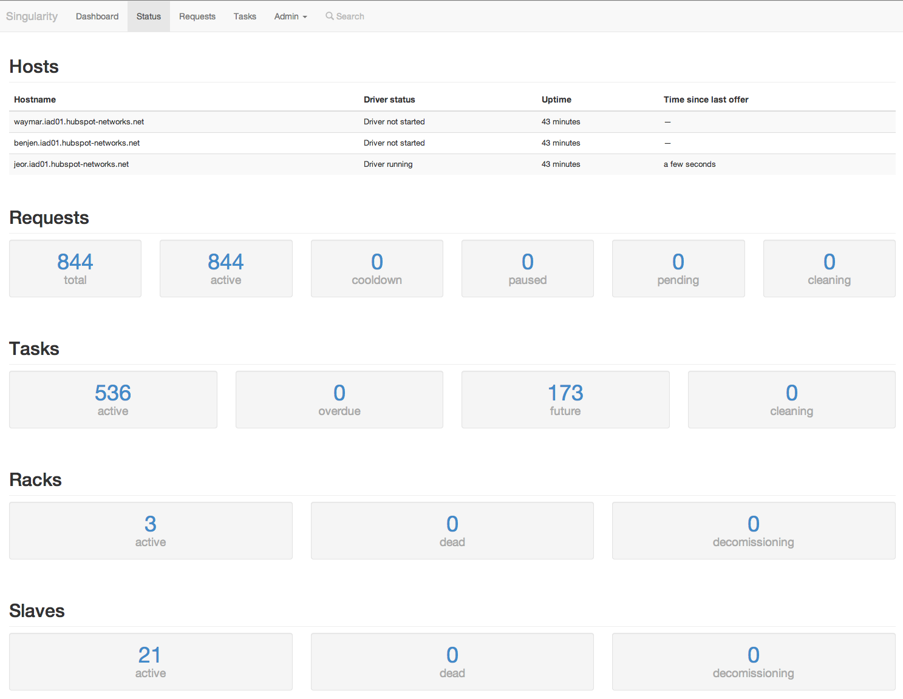
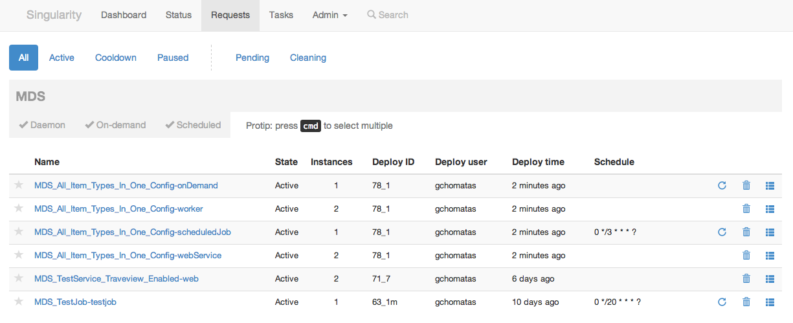
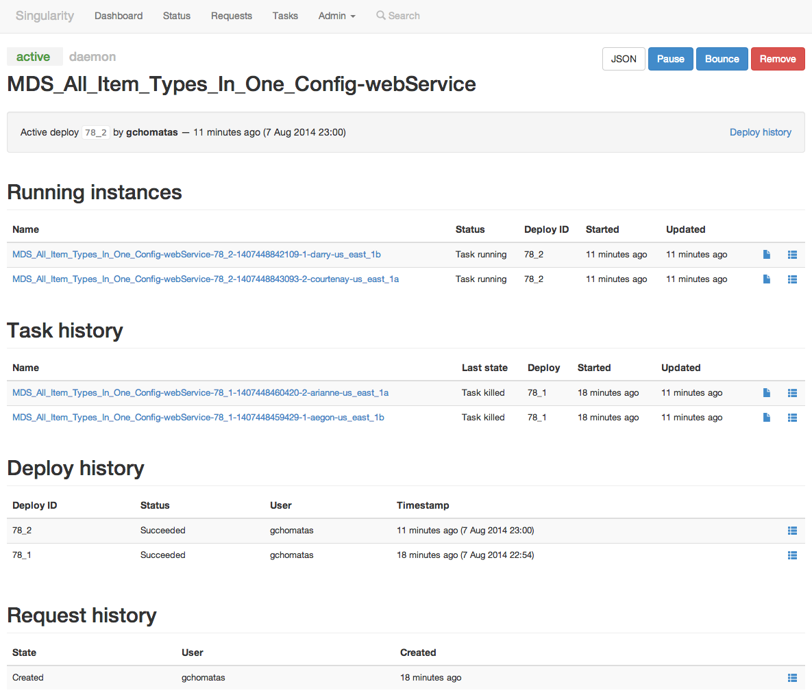
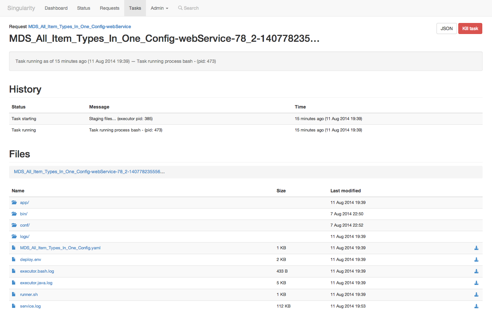
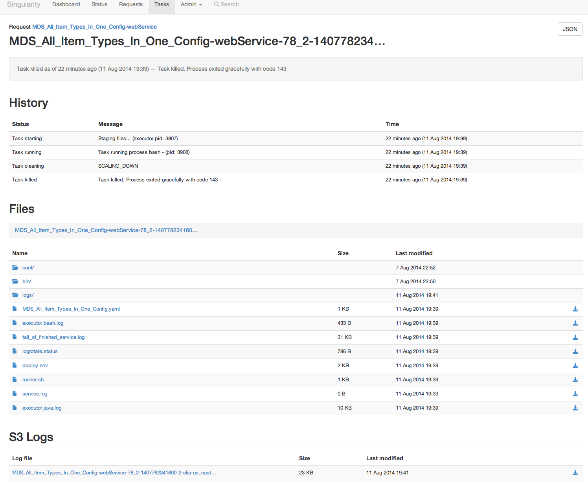
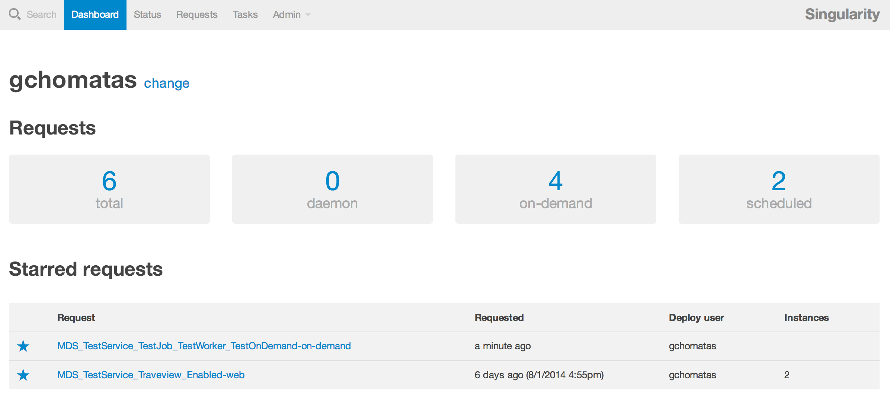
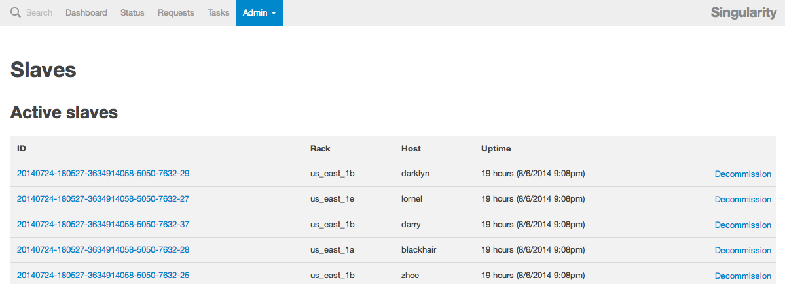
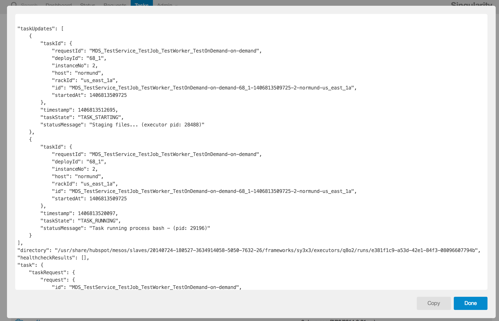

* [About Singularity Documentation](#about-singularity-documentation)
* [What is Singularity](#what-is-singularity)
* [How it Works](#how-it-works)
* [Singularity Components](#singularity-components)
  * [Singularity Scheduler](#singularity-scheduler)
    * [Singularity Scheduler Dependencies](#singularity-scheduler-dependencies) 
  * [Singularity Executor](#singularity-executor)
  * [Log Watcher](#log-watcher)
  * [S3 Uploader](#s3-uploader)
  * [Executor Cleanup](#executor-cleanup)
  * [Out Of Memory Killer](#oom-killer)
  * [Singularity UI](#singularity-ui)
* [Singularity API Abstractions](#singularity-api-abstractions)
  * [Singularity Request Object](#singularity-request-object)
  * [Singularity Deploy Object](#singularity-deploy-object)

## About Singularity Documentation
*Singularity* is a new and very active project and while we make a considerable effort to keep the documentation current, there is a possibility that you will find some inconsistencies or obsolete information.

Another note is that *Singularity* offers a quite extensive functionality and some of it is not currently documented. We understand that documentation is very important for open source projects to be useful and we are committed to consistently enhance and maintain the documentation as Singularity matures and its features become more stable. We appreciate any contribution towards making Singularity code and its documentation better.

The documentation that follows tries to give a brief yet complete overview of Singularity and its quite extensive context which resolves around Cluster Management, PaaS and Continuous Deployment tools / platforms. The apache Mesos ecosystem, which Singularity belongs to, is highly evolving and expanding every day. This is exciting but at the moment documentation is lacking and when we started we found it quite difficult to synthesize the whole picture. So the purpose of this document is to give you a good idea of the whole picture and let you quickly decide if Singularity is for you. Inside the document there are references to more detailed documents that expand on the relevant subjects and give detailed instructions on how to install, deploy and use Singularity components. 

All Singularity documentation except this README file (and some brief REAME files in sub projects) resides in the Docs folder. We suggest to start by reading this introductory material first and visit the detailed docs through the provided references.

## What is Singularity
**Singularity** is a platform that enables deploying and running services and scheduled jobs in cloud infrastructures, providing efficient management of the underlying processes life cycle and effective use of the cluster resources.


Singularity can be an essential part of a **continuous deployment** infrastructure and is ideal for deploying micro-services. It is optimized to manage thousands of concurrently running processes in hundreds of servers and provides out of the box: 
- a rich REST API for deploying as well as getting information on active and historical deploys and their underlying processes 
- a [web app client](Docs/SingularityUIForDevelopers.md) (Singularity UI) that uses the API to display user friendly views to all available information
- automatic rollback of failing deploys
- automatic fail over of services when the service itself or the server fails 
- automatic cool-down of repeatedly failing services
- health checking at the process and the service endpoint level
- load balancing of multi-instance services
- log rotation and archiving
- resource limits & resource isolation per service instance and graceful killing of instances that exceed their limits
- Rack / availability zone awareness for highly available deploys 

Singularity is a core component of HubSpot PaaS infrastructure allowing us to run thousands of concurrent services and has already executed many millions of tasks in our production and QA clusters.

## How it works
Singularity is an [**Apache Mesos framework**](http://mesos.apache.org/documentation/latest/mesos-frameworks/). It runs as a *task scheduler* on top of **Mesos Clusters** taking advantage of Apache Mesos scalability, fault-tolerance, and resource isolation. [Apache Mesos](http://mesos.apache.org/documentation/latest/mesos-architecture/) is a cluster manager that simplifies the complexity of running different types of applications on a shared pool of servers. In Mesos terminology, *Mesos applications* that use the Mesos APIs to schedule tasks in a cluster are called [*frameworks*](http://mesos.apache.org/documentation/latest/app-framework-development-guide/).


As the drawing depicts there are different types of frameworks and most frameworks concentrate in supporting a specific type of processing task (e.g. long-running vs scheduled cron-type jobs) or supporting a specific domain and relevant technology (e.g. data processing with hadoop jobs vs data processing with spark). 

Singularity tries to be more generic combining **long-running tasks** and **batch job scheduling** functionality in one framework to support many of the common process types that developers need to deploy every day. While mesos allows multiple frameworks to run in parallel, it is important and greatly simplifies the PaaS architecture having a consistent and uniform set of abstractions and APIs for handling deployments across the organization. This was one of the main reasons for HubSpot engineers to initiate the development of a new framework. As of this moment, Singularity supports the following process types:  
- **Web Services**. These are long running processes which expose an API and may run with multiple load balanced instances. Singularity supports automatic configurable health checking of the instances at the process and API endpoint level as well as load balancing. Singularity will automatically restart this type of tasks when they fail or exit and cool down them for a while when they repeatedly fail. 
- **Workers**. These are long running processes, similar to web services, but do not expose an API. *Queue consumers* is a common type of worker processes. Singularity does automatic health checking, cool-down and restart of worker instances.
- **Scheduled (CRON-type) Jobs**. These are tasks that periodically run according to a provided CRON schedule. Scheduled jobs will not be restarted when they fail. Singularity will run them again on the next scheduling cycle. There is provision for retries when starting a scheduled job. Check [this discussion document](Docs/ScheduledJobs) on current limitations and future directions in handling scheduled jobs.
- **On-Demand Processes**. These are manually run processes that will be deployed and be ready to run but singularity will not automatically run them. Users can start them through an API call or using the Singularity Web app.

## Singularity Components
Mesos frameworks have two major components. A **scheduler component** that registers with the **mesos master** to be offered resources and an **executor component** that is launched on cluster slave nodes by the  **mesos slave process** to run the framework tasks. 

The *mesos master* determines how many resources are offered to each framework and the *framework scheduler* selects which of the offered resources to use to run the required tasks. Mesos slaves do not directly run the tasks but delegate the running to the appropriate *executor* that has knowledge about the nature of the allocated task and the special handling that might be required.


As depicted in the figure, Singularity implements the two basic framework components as well as a few more to solve common complex / tedious problems such as task cleanup and log tailing / archiving without requiring developers to implement it for each task they want to run:

### Singularity Scheduler
The scheduler component matches client deploy requests to mesos resource offers. It implements the basic functionality of registering with a mesos master to accept resource offers and at the same time it acts as a web service offering a rich REST API for accepting deploy requests.

Clients use the Singularity API to register the type of deployable item that they want to run (web service, worker, cron job) and the corresponding runtime settings (cron schedule, # of instances, whether instances are load balanced, rack awareness, etc.). 

After a deployable item has been registered, clients can post *Deploy requests* for that item. Deploy requests contain information about the command to run, the executor to use, executor specific data, required cpu, memory and port resources, health check URLs and a variety of other runtime configuration options. Singularity scheduler will then attempt to match mesos offers (which in turn include resources as well as rack information and what else is running on slave hosts) with its list of *Deploy requests* that have yet to be fulfilled.

Rollback of failed deploys, health checking and load balancing are also part of the advanced functionality Singularity Scheduler offers. When a service or worker instance fails in a new deploy, Singularity scheduler will rollback all instances to the version running before the deploy keeping the deploys always consistent. After the scheduler makes sure that a mesos task (corresponding to a service instance) has entered the TASK_RUNNING state it will use the provided health check URL and the specified health check timeout settings to perform health checks. If health checks go well, the next step is to perform the Load Balancing of service instances. Load balancing is attempted only if the corresponding deployable item has been defined to be *loadBalanced*. To perform the load balancing between service instances, Singularity supports integration with a Load Balancer API. Singularity will post requests to the Load Balancer API to add the newly deployed service instances and to remove those that were previously running. Check [Integration with Load Balancers](Docs/Integration_With_Load_Balancers.md) to learn more.

#### Singularity Scheduler Dependencies
Singularity scheduler uses ZooKeeper as a distributed replication log to maintain state and keep track of registered deployable items, the active deploys for these items and the running tasks that fulfill the deploys. As shown in the drawing, the same Zookeeper quorum utilized by mesos masters and slaves is reused for singularity.  

Since Zoopkeeper is not meant to handle large quantities of data, Singularity utilizes MySQL database to periodically offload metadata from Zookeeper and keep historical records of deployable item changes, deploy request history as well as the history of all launched tasks. 

In production environments Singularity is run in high-availability mode by running multiple instances of the Singularity Scheduler component. As depicted in the drawing, only one instance is always active with all the other instances waiting in stand-by mode. While only one instance is registered for receiving resource offers, all instances can process API requests. Singularity uses Zookeeper to perform leader election and maintain a single leader. Because of the ability for all instances to change state, Singularity uses queues which are consumed by the Singularity leader to effect changes in Mesos. 
### Singularity Executor
The *executor component* runs on all mesos slave hosts. It registers with the mesos slave process running in the slave host and receives requests to run the commands that correspond to mesos tasks which in turn correspond to instances of the deployable items managed by Singularity. The requests sent to the executor contain all the required data for setting up the running environment like the command to execute, environment variables, executable artifact URLs, application configuration files, etc.

Besides the above basic functionality, *Singularity Executor* offers some advanced features:
- Download and extract **External Artifacts**. Given the URLs of zipped artifacts it downloads and extracts the artifacts inside the task sandbox (the folder allocated to a running task). These artifacts usually contain the executable code for the task.
- Download and extract **S3 Artifacts**. Given the *bucket name* and the *Object Key* executor can directly download executable artifacts from Amazon S3 service. Credentials are set in the executor configuration file.  
- **Log Rotation**. For each process initiated by the executor, a log rotation configuration file is created. The generated file is compatible with the Linux **logrotate** program and is saved in a configurable directory.
- **Task Sandbox Cleanup**. When a task fails, is being killed or gracefully finishes, executor will automatically cleanup application files and logs making sure that slave disk space is properly maintained without the need for additional external cleanup programs.
- **Graceful Task Killing with configurable timeout**. Executor tries to gracefully kill tasks by initially sending a SIGTERM signal and then waiting for a configurable number of milliseconds for the task to terminate before it tries to kill the task with a SIGKILL signal. The number of milliseconds to wait is send to the executor by Singularity scheduler on each task execution as part of the executor data.
- **Environment Setup**. The executor accepts a map of environment variables and automatically creates an *environment setup* shell script that sets the defined variables.
- **Runner Script**. A *task runner* shell script is auto-generated for each task. The script runs system-wide scripts in *profile.d* as well as local *profile.d* scripts inside the extracted artifact, initializes the environment vars (using the environment setup script) and finally runs the requested task command as the requested user.

### Log Watcher
Log watcher is a service that run in each slave and provides logs tailing and streaming / forwarding of tailed log lines to third party services like *fluentd* or *logstash* to support real time log viewing and searching. This is an optional add-on not required for Singularity to provide its basic functionality.

### S3 uploader
S3 uploader runs in each slave and moves the rotated task log files to Amazon S3 Service for archiving. This is an optional add-on not required for Singularity to provide its basic functionality.

### Executor Cleanup
While the executor itself will cleanup application files and logs upon task termination, there are cases that the executor may fail or crash. In heavy loaded slaves, this could quickly result in unexpected full disk space and slave failures. The **Executor Cleanup** is a utility program that is meant to run in each slave through the Unix CRON program (e.g once per hour) to find out and clean up the sandbox of finished / failed tasks that the executor has failed to clean.

### OOM Killer
The **Out of Memory process Killer** is an optional service that Singularity users may wish to run in heavy loaded mesos slaves to replace the default  memory limit checking supported by **Linux Kernel CGROUPS**. 

HubSpot engineers have found out that a bug related to OOM handling was introduced in Linux Kernel after version 3.12. The bug causes a deadlock when OOM events are handled by CGROUPS which then requires a system reboot. 

A [bug](https://bugzilla.kernel.org/show_bug.cgi?id=80881) has been filled and it is expected to be fixed in version 3.16.

In addition to the above bug, in version 2.6.x kernels, under heavy file IO that consumes the page cache, CGROUPS includes the consumed page cache in its accounting and causes OOMs.

 At the moment Linux Kernel version 3.4 is used in HubSpot slaves that seems to give a stable behavior; it does not have the bug and it also does not appear to trigger CGROUPS OOMs because of cache usage. 

 In any case, if users wish to run the *OOM Killer* service they should disable the CGROUPS memory limit checking in their mesos slaves.        

### Singularity UI
*Singularity UI* is a single page web app that uses Singularity API to present information about deployed items. 



It allows to search and display information about active, paused, cooled down, cleaning and pending items.



Selecting a specific deployed item will display information about its active running tasks, all historical tasks from past deploys, a list of all executed deploys and a list of all updates to item settings (owners, instances, etc.) 



Selecting an active task will display information about the task and provide access to application files and task logs.



Historical information about past task executions are also available and SingularityUI allows to directly retrieve the archived log files.



A dashboard with the user's deployed and favored items is available.



While Singularity UI is mostly a viewing app it has some limited functionality for performing certain actions on registered deployable items and their tasks:

- Remove a deployed item. All running tasks (e.g. the service instances if it is a web service) are terminated and the item is unregistered from Singularity. Historical logs are not removed and will be connected with the item if it is re-registered to Singularity at a later stage.
- Pause a deployed item. All running tasks are stopped but the item is not removed. Deploys of paused items are not possible. Users can un-pause the item to restart its tasks and be able to deploy.
- Manually run a *Scheduled Job* or *On-Demand* item
- Kill a running task. Tasks corresponding to instances of *web service* or *worker* items will be re-started instantly (possibly) in another slave. Scheduled tasks will behave as if the task failed and may be rescheduled to run in the future depending on whether or not the job item has *numRetriesOnFailure* set.
- Decommission a slave which means that all tasks running in the specific slave will be migrated to other slaves
- Decommission a *logical rack*, meaning that all slave hosts in the rack will be decommissioned. The *rackid* attribute can be used when running the mesos slave process to specify which rack the slave belongs to. For example when running in AWS a rack could corresponds to the availability zone ( /usr/local/sbin/mesos-slave --attributes=rackid:us-east-1e).




For all displayed information, access is provided to the API payloads from which views are created. This can greatly help debugging of deploys and can be used by developers that create tools on top of Singularity API.



### Singularity Java Client
The *java client* provides instant access to most of the Singularity API functionality and can be used to create deploy services upon Singularity platform. The *Mesos Deploy Service* that manages deploys in HubSpot uses the java client to register the deployable items in Singularity, perform deploys for them, rollback deploys and poll the status of deployed or currently running items.


## Singularity API Abstractions
Singularity provides a *deploy oriented* layer on top of *Mesos Tasks* with its **Singularity Request** and **Singularity Deploy** abstractions. This section provides an introduction to these two central concepts. Check the [Singularity API Reference](Docs/Singularity_API_Reference.md) for a complete description to all Singularity Endpoints and their respective request and response objects.  

### Singularity Request Object
A **Singularity Request Object** defines a *deployable item*. Before a deployable item can be deployed, users should register the type and other relevant properties of the item by posting a *Singularity Request Object* to **/requests** endpoint. The following are the supported properties:
- **id** (String - Mandatory): The name of the deployable item which should be unique. This is the only mandatory object property since there are defaults for all other. A *Singularity Request Object* with only the *id* set corresponds to an item that is a daemon with one instance, not load balanced and not rack sensitive. Whether it is a *Web Service* or a *Worker* cannot be inferred with only this information available (future versions will deprecate the *daemon* property and provide an explicit *item type* property to clearly define what the item is meant to be).  
- **owners** (List of strings - Optional): A list of emails for the people (developers probably) which are responsible for this deployable item. This is a very important piece of information because Singularity will use the emails to send notifications when the relevant mesos tasks fail are get lost with possible directions of what should be done.
- **daemon** (boolean - optional): This is by default *true* which means that the *deployable item* is either a *web service* or a *worker process*. In practice *daemon* set to *true* means that Singularity will try to restart you service / worker whenever it terminates (either gracefully or because of failure). It needs to be set to **false** when a *Scheduled CRON Job* or an *On-Demand* process is registered.
- **instances** (integer - optional): If item is a a *web service* or a *worker process* then the number of identical instances to run can be specified. Each instance corresponds a *mesos task* which in turn will result in a *Unix Process* to be spawned by *Singularity Executor* in one of the slaves. Default is 1 instance.
- **rackSensitive** (boolean - optional): This property is by default set to *false* and has a misleading name that should probably be renamed to *failIfNoSeparateRackPerInstance*. If the deployable item is a a *web service* or a *worker process* and the number of specified *instances* to run is more than one then setting *rackSensitive* to *true* will instruct Singularity to **FAIL** the deploy if it does not succeed to split the load in different *logical racks*. When running in AWS, each *logical rack* could correspond to different *availability zone* (The *rackid* attribute can be used when running the mesos slave process to specify which rack the slave belongs to). So for example if 3 instances have been specified and *rackSensitive* is *true* but slaves exist in only two availability zones or slaves are full in capacity in the third availability zone, then the deploy will fail.
- **loadBalanced** (boolean - optional): Set by default to *false*. If the deployable item is a a *web service* and multiple *instances* have been set then setting *loadBalanced* to *true* instructs Singularity to use the *Load Balancer API* to load balance the instances after they run. The *Load Balancer API* URL / base path is set inside Singularity Configuration file. The default is *false*.
- **schedule** (string - optional). The schedule if the deployable item is a *Scheduled CRON Job*, specified in CRON format
- **numRetriesOnFailure** (integer - optional): This setting is only used for items that their type is *Scheduled CRON Job* and specifies how many times should Singularity try to run the Job if the job fails to start. This is useful for jobs with a daily or even more rare schedule and prevents long delays before the job is tried again if it happens for the job to occasionally fail to start.

When a deployable item is already registered, users may re-post a *Singularity Request Object* to update the item settings. Item types cannot be changed, though. The user should first completely remove the registered item and then re-register it with a different type, e.g. change daemon from false to true, or remove the schedule and change the daemon from false to true.

In the next version of Singularity we plan to deprecate the *daemon* property and introduce an enumerated value for the item type that gets the values: *webService*, *worker*, *scheduledJob*, *onDemand*.

The following are example *Singularity Request Objects* for registering different deployable item types. They are provided in JSON format and can be directly used as payloads in API calls.

*Singularity Request Object* for a **load balanced Service with 3 instances** each one running in a different logical rack
```javascript
{
    "id": "TestService",
    "owners": [
        "feature_x_team@mycompany.com",
        "developer@mycompany.com"
    ],
    "daemon": true,
    "instances": 3,
    "rackSensitive": true,
    "loadBalanced": true
}
```


*Singularity Request Object* for a **scheduled job**
```javascript
{
    "id": "TestJob",
    "owners": [
        "feature_x_team@mycompany.com",
        "developer@mycompany.com"
    ],
    "daemon": false,
    "schedule": "0 */3 * * * ?",
    "numRetriesOnFailure": 5
}
```

*Singularity Request Object* for a **worker**
```javascript
{
    "id": "TestWorker",
    "owners": [
        "feature_x_team@mycompany.com",
        "developer@mycompany.com"
    ],
    "daemon": true
}
```

*Singularity Request Object* for an **on-demand** process
```javascript
{
    "id": "TestJob",
    "owners": [
        "feature_x_team@mycompany.com",
        "developer@hmycompany.com"
    ],
    "daemon": false
}
```

Having registered a deployable item does not result in having the item deployed. After registration Singularity will accept deploy requests for the registered item. Information on how to deploy a registered item deploy is captured in the *Singularity Deploy Object* 

### Singularity Deploy Object
A **Singularity Deploy Object** 

